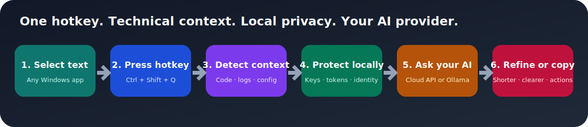

<div align="center">

# AI 文本优化器

**在任意 Windows 应用中选中文字，按一次全局热键，交给你自己的 AI 服务处理。**

[](https://github.com/owdf/ai-text-optimizer/actions/workflows/ci.yml)
[](https://github.com/owdf/ai-text-optimizer/releases/latest)
[](#安装-windows-版本)
[](LICENSE)

[下载 Windows 版](https://github.com/owdf/ai-text-optimizer/releases/latest) · [English](README.md) · [报告问题](https://github.com/owdf/ai-text-optimizer/issues/new)

</div>



## 它解决什么问题

排查终端报错、翻译技术文档或润色邮件时，传统流程通常是离开当前应用、打开聊天窗口、粘贴、等待，再把结果复制回来。

AI 文本优化器把流程缩短为：

1. 在任意 Windows 应用中选中文字；
2. 按 `Ctrl+Shift+Q`，热键可自定义；
3. 查看 AI 结果并一键复制。

程序会识别前台应用，并通过可解释的规则判断选区更像代码、报错、日志、配置还是普通文本，再选择相应提示词。用户仍可手动锁定模板和 AI 服务。

## 它和普通改写工具有什么不同

多数改写工具是围绕语气预设搭建的网页编辑器。AI 文本优化器针对的是本地技术工作流：

- **请求发出前先脱敏：** Privacy Shield 在本机替换高置信度的密钥、鉴权令牌、邮箱和 Windows 用户名；只有仍保持原样的占位符会在本地结果中回填。
- **理解技术上下文：** 根据前台应用和内容规则，把代码、堆栈、日志、配置交给专用提示词，而不是一律做普通润色。
- **不必重新开对话：** 可把当前结果一键变得更精简、更清晰，或转换成按优先级排列的行动清单。
- **变化可检查：** 结果栏显示本地计算的变化比例和字符增减，不额外调用 AI。
- **模型由用户掌控：** 可连接兼容云接口或 Ollama 等本机模型；项目不要求注册账号，也不通过项目方服务器转发内容。

## 功能

- Windows 全局热键，可在界面中重新录制。
- 针对代码、报错、日志、配置、翻译和总结的上下文提示词路由。
- 10 个内置模板，并支持自定义模板。
- 支持 OpenAI 兼容接口、Anthropic Messages API 和本地 Ollama。
- 中英文界面。
- 默认开启的本地 Privacy Shield，并显示本次保护条目数。
- “更精简”“更清晰”“行动清单”三个连续精炼动作。
- 本地计算的原文/结果变化指标。
- 获取选区后恢复原剪贴板内容。
- 托盘设置：服务商、接口地址、模型、API 密钥、热键和语言。
- 远程自定义接口必须使用 HTTPS；只有本机回环服务可以使用 HTTP。

## 安装 Windows 版本

### 要求

- Windows 10 或 Windows 11；
- 支持的云端 AI 服务密钥，或 Ollama 等本地 OpenAI 兼容服务。

### 安装步骤

1. 打开[最新版本页面](https://github.com/owdf/ai-text-optimizer/releases/latest)；
2. 下载 `AITextOptimizer-Windows-x64.zip`；
3. 可使用 `SHA256SUMS.txt` 核对压缩包完整性；
4. 解压后运行 `AITextOptimizer.exe`；
5. 右键托盘图标，打开“设置”，填写 AI 服务信息。

目前 EXE 尚未购买代码签名证书，Windows SmartScreen 可能显示“未知发布者”。请确认文件来自本仓库，并在运行前核对 SHA-256。

打包版默认把配置、自定义模板和日志保存在 `%LOCALAPPDATA%\AITextOptimizer`。如果 EXE 同目录已有 `config.json`，程序会将其作为便携配置使用。

## 从源码运行

```powershell
git clone https://github.com/owdf/ai-text-optimizer.git
cd ai-text-optimizer
py -3.10 -m venv .venv
.\.venv\Scripts\Activate.ps1
python -m pip install -r requirements.txt
Copy-Item config.example.json config.json
python main.py
```

支持 Python 3.10 及以上版本。由于选区获取、前台窗口识别和全局输入监听依赖 Windows API，程序仅支持 Windows。

## 服务配置

建议通过托盘“设置”界面完成配置。对应 JSON 结构如下：

```json
{
  "ai_service": {
    "provider": "openai",
    "api_key": "你的 API 密钥",
    "base_url": "https://api.openai.com/v1",
    "model": "gpt-4o",
    "max_tokens": 2000,
    "temperature": 0.7
  },
  "hotkey": {
    "trigger": "ctrl+shift+q",
    "enabled": true
  },
  "privacy": {
    "enabled": true
  }
}
```

`openai` 适用于实现 `/v1/chat/completions` 的兼容服务；Anthropic Messages API 请选择 `anthropic`。类似 `http://localhost:11434/v1` 的本机回环地址允许不填写 API 密钥。

## 隐私与安全

- 只有按下热键后成功获取到的新选区文本才会被处理。
- 如果模拟复制没有产生新的剪贴板内容，程序不会提交旧剪贴板文本。
- Privacy Shield 默认开启。每次联网请求前，它会在本机检测高置信度密钥和身份标识，替换为带类型的占位符，并只在本地结果中回填未被模型改动的占位符。
- Privacy Shield 是降低误传风险的安全层，不是完整的数据防泄漏系统。极敏感内容仍应人工检查，或改用本机模型。
- 选中文字会发送给用户配置的服务商；处理机密内容前请自行确认服务商的数据政策。
- API 密钥保存在本地配置中，项目已忽略真实 `config.json`。
- 远程自定义接口必须使用 HTTPS，HTTP 仅允许本机模型使用。

## 开发与验证

运行完整测试：

```powershell
python -m pip install pytest -r requirements.txt
python -m pytest -q
```

构建独立 EXE：

```powershell
python -m pip install pyinstaller
python build.py
```

输出文件是 `dist/AITextOptimizer.exe`。CI 会在 Python 3.10 和 3.12 上运行测试，并实际执行一次 Windows 打包。推送 `v*` 标签后，Release 工作流会生成安装压缩包和 SHA-256 校验文件。

## 项目结构

```text
main.py                 应用生命周期和 UI 协调
ai_service.py           OpenAI 兼容接口与 Anthropic 适配
context_analyzer.py     前台窗口识别与文本分类规则
privacy_shield.py       本地密钥和身份标识脱敏
change_metrics.py       确定性的原文/结果变化指标
clipboard.py            选区获取与剪贴板恢复
hotkey.py               全局热键监听
prompt_templates.py     内置和自定义提示词模板
config.py               持久化设置
ui/                     托盘、结果、设置、热键和模板窗口
tests/                  单元测试和回归测试
build.py                PyInstaller 构建入口
```

## 当前限制

- 仅支持 Windows；
- 当前需要等待服务商完成响应后才显示结果，尚未实现逐 token 流式显示；
- 一个请求结束前不能触发第二个处理请求；
- 上下文分类采用启发式规则，判断不准确时可手动选择模板。

## 参与贡献

欢迎提交 Issue 和 Pull Request。报告问题时请提供 Windows 版本、Python 或 Release 版本、服务类型、复现步骤，并删除日志中的密钥等敏感信息。

## 许可证

[MIT](LICENSE) © 2026 Dongfang Wang。
